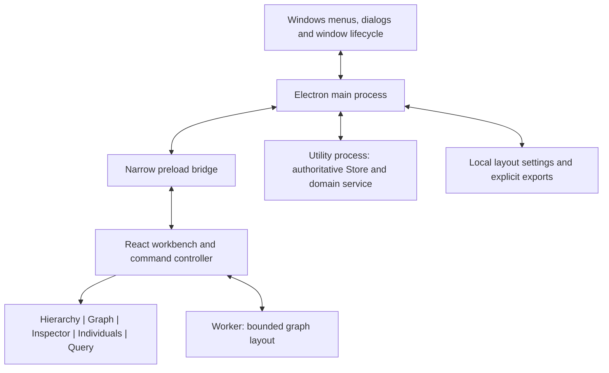

# Axiom Electron Rewrite Research

Current keyboard research and implementation: [Windows keyboard conventions](windows-keyboard-conventions.md).

**Status:** Historical research written before the approved rewrite. Electron is now the sole active implementation. See [the delivered implementation](implementation.md), [architecture decisions](../../docs/decisions.md) and [verification](../../docs/verification.md) for current behavior and measurements. The assessment below preserves its original evidence and recommendations.

## Recommendation

I recommend an Electron and TypeScript rewrite as Axiom's next architectural direction, beginning with a packaged workbench prototype. The first deliverable should demonstrate conventional desktop menus and panes that can actually be resized, rearranged and restored. Completing that interaction model before porting every ontology feature would establish whether the rewrite addresses the present usability problem.

The proposed stack is Electron, React, a dedicated docking library, Monaco for the query editor, and AG Grid Community for the individuals and query-result tables. FlexLayout is the first docking candidate; Dockview is the alternative. The graph renderer needs a separate performance and visual-conformance evaluation. These choices reuse existing interaction machinery while keeping ontology semantics under Axiom's control.

Electron supplies desktop integration and menu APIs. VS Code's workbench is additional application code, and Monaco is its editor component. Consequently, Electron alone does not provide VS Code's pane management or command system. Combining Electron with an established docking library is the relevant route for Axiom.[^1][^2][^3]

The recommendation is conditional on a working Windows prototype. No Electron memory, startup or graph-performance measurements exist for Axiom. The existing 400 MB working-set limit and 3,000-node rendering requirements are material constraints, and they remain in force until explicitly revised.[^4]

## Existing application and specification

The current implementation uses .NET 8, WinUI 3 and Win2D. Its verification record reports 150 passing domain and geometry tests and 15 passing native automation journeys, while explicitly leaving complete specification conformance open. That is useful migration evidence, but it does not establish that every everyday interaction works satisfactorily.[^5]

The current shell arranges a hierarchy, graph, inspector and lower data area. Its shortcomings in pane resizing and rearrangement concern the workbench itself. A rewrite that reproduces the same fixed arrangement with HTML and small custom drag handles would preserve the underlying problem. The new shell needs independent acceptance criteria for actual user operations.

The specifications already distinguish framework-neutral requirements from advisory native-stack mappings. A TypeScript implementation can preserve the Store, Viewport, graph-budget and query contracts. Flexible docking and persistent pane layouts would, however, change explicit existing assumptions: the suite currently excludes persistence of window geometry, panel sizes and preferences.[^6]

The proposed change is therefore broader than a language port. It replaces the shell interaction model while retaining the ontology behaviour as the starting contract. Existing specification resolutions should carry forward, including corrected triple counts, protection of pinned nodes when reducing Budget, and query semantics.[^7]

## What comes with Electron

| Capability | Supplied foundation | Work still required in Axiom |
| --- | --- | --- |
| File/Edit/View menu bar | Electron Menu and MenuItem APIs, roles and accelerators | Define commands, enabled states, document behaviour and focus routing |
| Ordinary application windows | Electron BrowserWindow and the operating-system window frame | Choose bounds, minimum size, lifecycle and restoration rules |
| Open/save dialogs and clipboard | Electron desktop APIs | Implement file formats, exports and validation |
| Resizable docked panes | A docking library such as FlexLayout or Dockview | Choose allowed moves, minimum sizes and state ownership |
| Tabs and pane rearrangement | The docking library | Preserve selection, editor state and graph camera during moves |
| Separate pane windows | Electron windows plus docking integration | Prove compatibility, window ownership and recovery |
| Query text editing | Monaco | Supply SPARQL syntax support and connect Axiom's query engine |
| Virtualised tables | A grid library | Map rows, validation, sorting and Store mutations correctly |
| Command palette | Axiom or a larger workbench platform | Register commands and implement filtering and focus behaviour |
| Ontology editing, graph Budget and queries | Existing Axiom specification | Port and verify the domain implementation |

Electron's standard menu roles reduce the amount of ordinary editing behaviour that must be recreated. On Windows and Linux, Electron's menus use Chromium-style implementations; the menu API does not turn the application's web controls into WinUI controls. A conventional Windows frame and visible application menu are still appropriate defaults.[^2][^8]

Electron can create a default application menu, but a production Axiom menu should be deliberately defined. Development actions such as reload and developer tools should not occupy the normal user command surface.[^9]

## Pros and cons

These are architectural tradeoffs, not benchmark results.

| Area | Pros | Cons and implications |
| --- | --- | --- |
| Familiar desktop behaviour | Electron provides window and menu integration; docking libraries already implement pane mechanics | Axiom still needs coherent command routing, focus management and persistence |
| Interface development | React integrates with established editors, grids and docking components | Several libraries must share styling, keyboard conventions and lifecycle rules |
| Pane flexibility | Tabs, split groups and saved layouts can replace the fixed composition | Moving a pane can expose bugs in component mounting, canvas size and focus restoration |
| Windows appearance | Standard window controls and a restrained workbench can feel familiar | Web content does not automatically follow every Windows appearance or accessibility setting |
| Graph implementation | Browser rendering supports established graph libraries and custom drawing | Existing Win2D performance does not predict browser performance |
| Large datasets | Virtualised grids and background execution can support the specified scale | Multiple processes and copied datasets can consume the memory budget |
| Deployment | A packaged application includes its runtime; the recipient need not install Node | The distribution includes Chromium and Node, increasing runtime and packaging footprint |
| Testing | Browser interaction automation can exercise real dragging and content behaviour | OS menus, native dialogs and assistive technology require additional Windows testing |
| Maintenance | The TypeScript ecosystem offers reusable components and tooling | Electron and dependency upgrades become a recurring maintenance responsibility |
| Future platforms | UI and domain code can be structured for reuse | macOS/Linux delivery still requires platform testing, packaging and interaction decisions |
| Rewrite scope | A fresh shell can remove current structural constraints | Domain porting and parity checks are substantial work; existing tests cannot simply be declared applicable |

Electron's process model supports separation between the privileged application process, rendered content and utility work. That separation can improve responsiveness and isolate failures, but it also creates process coordination and memory costs.[^10]

Its support policy covers the latest three stable release lines. The project should budget for regular runtime updates and repeatable package verification, rather than treating the initial Electron version as a permanent platform.[^11]

The strongest reason to choose this route is access to components that already implement the workbench interactions Axiom needs. The strongest reason to pause would be a failed prototype against the memory or graph-performance constraints.

## Axiom workbench versus a complete IDE platform

| Approach | Benefit for Axiom | Cost or limitation | Recommendation |
| --- | --- | --- | --- |
| Electron + React + docking library | Direct control over an ontology-oriented application with reusable pane mechanics | Axiom owns command registration, session persistence and component integration | Preferred starting point |
| Eclipse Theia | Supplies a broader platform for widgets, commands, preferences and editor-based tools | Introduces its extension model, dependency injection and frontend/backend architecture | Consider if extensibility becomes a product requirement |
| Code OSS fork | Starts with an existing editor workbench | Requires maintaining a fork and adapting substantial editor-oriented application code | Do not start here for the present scope |
| Continue the native implementation | Retains tested domain code and the current rendering path | Requires a separate shell redesign and a suitable docking solution | Retain as a comparison and fallback |

Theia is a legitimate alternative when the goal is to inherit a larger workbench. Its application-composition documentation supports assembling existing extensions with custom tool functionality, and distinguishes Theia from a VS Code fork.[^12] Its architecture separates a frontend from a Node backend, including local operation under Electron.[^13]

For Axiom's current scope, I favour a smaller application assembled around its five visible panel types. There is no demonstrated requirement for a general extension host, terminal or source-code project system. If plugins or remote browser access become central requirements, Theia deserves a prototype alongside the narrower stack.

A Code OSS fork also requires distinguishing the MIT-licensed source repository from Microsoft's Visual Studio Code distribution, proprietary assets and service integrations. Access to Microsoft's extensions and Marketplace-related features should not be assumed from the source licence.[^14]

## Docking library assessment

### FlexLayout

FlexLayout is a React layout manager with tabsets, splitters, tab and group movement, floating panels, popout windows and JSON layout state. Its current README also documents keyboard operation, ARIA semantics, visible focus and preservation of component state when tabs move.[^15]

The inspected repository package identifies version 0.10.8, React 18 or 19 peer compatibility, and Node 20 or later for its development environment. That is a repository snapshot, not confirmation that every documented feature is present in the package selected from the registry. The licence file is MIT.[^16][^17]

I recommend testing FlexLayout first because its documented feature set covers the requested shell without introducing a paid tier for the initial selection. Keep its integration behind a small adapter that maps Axiom panel identifiers to library nodes. Avoid spreading layout-library calls throughout ontology components.

The acceptance risk is integration, especially popouts. A README claim about preserving React component state does not prove that a graph canvas, Monaco model and asynchronous query retain the intended behaviour across Windows monitors. Those operations need to work in the packaged application before FlexLayout becomes the committed dependency.

### Dockview

Dockview remains a strong alternative. Its current licence matrix lists dockable grids, tab/group dragging, resizable splitters, floating groups, popouts and saved layouts in the free MIT edition. It places features including layout history, auto-hide edge groups, spatial keyboard navigation and keyboard docking in Enterprise.[^18]

Its keyboard documentation explicitly labels the built-in docking keymap as Enterprise, while identifying programmatic focus APIs that can support application-owned handlers. Axiom could implement simple menu commands such as Move Pane Left through public APIs, but should account for that work when comparing the free editions.[^19]

There is also a packaging constraint. Dockview's current popout documentation requires a same-origin HTTP or HTTPS URL. Electron's security guidance recommends a controlled custom protocol for local application content. Therefore a proposed `app://axiom` origin cannot simply be assumed to work with Dockview's standard popout path.[^20][^21]

This does not prevent internal docking. It means detached windows require a supported integration design or a different candidate. Do not weaken origin checks to make a demo work. Keep internal docking, floating within the main window, and independent OS windows as three separately verified capabilities.

### Selection gate

Use the same five sample panels in both candidates if the first candidate fails. Include a real Monaco editor, a scrolling grid and a continuously resizing graph canvas. Verify mouse dragging, keyboard movement and session restoration with the production origin and sandbox settings.

Select the candidate that completes those operations with the least application-specific workaround code. A static layout screenshot or a successful browser demo is insufficient evidence. Purchase-dependent features should be identified before they become part of the promised interaction contract.

## Proposed stack

| Responsibility | Initial choice | Boundary |
| --- | --- | --- |
| Desktop runtime | Supported stable Electron release | Windows lifecycle, menus, dialogs, clipboard and packaging integration |
| Application language | TypeScript with strict checking | Domain contracts and all new application code |
| Interface composition | React | Panel contents and application-level state subscriptions |
| Docking | FlexLayout, subject to prototype | Layout, drag targets, splitters and panel groups |
| Ordinary controls | Fluent UI React | Buttons, fields, dialogs and compatible tree controls |
| Query editor | Monaco ESM package | Editor models and editing behaviour |
| Data tables | AG Grid Community | Virtualised row presentation and keyboard interaction |
| Graph | Bounded renderer adapter, with Cytoscape.js evaluated first | Graph presentation only; Axiom retains layout and Budget semantics |
| Background work | Electron utility process and a layout worker | Store/query work and layout computation |
| Build and package | Electron Forge with TypeScript/Webpack initially | Reproducible production assets and Windows payloads |
| Interaction testing | Playwright plus Windows automation/manual review | Web content and actual desktop behaviour |

Fluent UI provides React and web component libraries; adopting it offers a common component vocabulary, not a guarantee of native Windows appearance. Its theme needs to be reconciled with Axiom's ontology colours and interaction density.[^22]

Forge documents compilation of the main process, renderer and preload through its Webpack plugin. Its Vite plugin is still explicitly labelled experimental and may introduce breaking changes in minor releases. Vite remains an option, but should be a deliberate tooling choice rather than an unqualified default.[^23][^24]

Pin the chosen package versions and lockfile when implementation starts. Confirm the docking features against those exact installed versions. Current documentation and repository branches can describe capabilities beyond a previously published release.

## Process and state architecture

The new application should have one authoritative ontology Store. Pane movement must not copy ownership of entities, create competing stores or regenerate the fixture.

This diagram is a proposed responsibility map. It does not imply that full Store contents travel through the main process for every interaction. Electron utility processes support message ports that can carry approved communication directly between a renderer and background work.[^25]

The main process should own native windows, application lifecycle and approved filesystem operations. It should not perform force simulation, scan the dataset synchronously or run queries in its event loop. The preload should expose named operations with validated arguments instead of general Electron or Node access.

The domain service should own entities, indexes and revision numbers. It returns bounded graph neighbourhoods, table windows and query-result batches. Each request carries a request identifier and Store revision so an old response cannot overwrite a newer selection or regenerated dataset.

The workbench controller should own panel identities and transient presentation state. Selection uses entity IRIs, never a row index or a label. The graph camera, table filter and query editor state belong to their logical panels, independently of where those panels are docked.

The layout worker receives only the bounded Viewport and returns positions tagged with a layout generation. A stale generation is discarded after a new seed or layout choice. Do not publish every force tick through React state or clone the full dataset on each update.

Initially, query evaluation can run cooperatively inside the domain utility process with bounded yielding and cancellation checkpoints. A long synchronous loop would still delay cancellation messages even outside the UI process. If a separate query worker is later required, measure snapshot and index duplication against the memory budget before adopting it.

## Menu and command contract

The following is a proposed production command structure. It deliberately distinguishes currently specified operations from future document support.

| Menu | Initial command responsibilities |
| --- | --- |
| File | Dataset selection/regeneration, graph export, exit; add ontology Open/Save only with real format support |
| Edit | Focus-aware Undo/Redo, text clipboard operations, supported entity editing, find |
| View | Show each panel, themes, interface zoom, command palette and reset layout |
| Graph | Fit, relayout, layout mode, freeze, Budget controls, clear and export |
| Query | Run, cancel, worked examples and send results to graph |
| Window | Move active pane, split/group operations, focus traversal and supported detach/reattach |
| Help | Shortcuts, product information and diagnostics |

Every action should have one command identifier and implementation. Menus, toolbar buttons, keyboard bindings and the command palette invoke that implementation with the same enabled-state logic. This prevents a toolbar action from succeeding while its equivalent menu item operates on stale state.

Undo requires explicit focus rules. With the query editor focused, it edits the query's history. After a committed ontology mutation, a domain Undo command restores Store state. A generic Electron editing role does not automatically implement ontology Undo.

Context also determines Copy and Find. Copying an entity IRI differs from copying selected text or tabular cells. The command should operate on the focused surface, and its label or availability should make the operation clear.

The existing suite excludes OWL import and serialization. A native Save dialog supplies path selection, not persistence. If true document Open/Save becomes part of the rewrite, add format, error-handling and round-trip acceptance criteria as a distinct scope change.[^6]

## Pane behaviour and restoration

Expose Hierarchy, Graph, Inspector, Individuals and Query as separately addressable panels. Individuals and Query can begin in one bottom tab group, while remaining independently movable. This preserves the four logical work areas without forcing their physical arrangement to remain fixed.

The proposed interaction contract includes the following:

1. Drag a pane tab to another group, reorder tabs, or create a split beside an existing group.
2. Resize every split with a visible affordance and a practical pointer target.
3. Move and resize panes through keyboard-accessible commands.
4. Maximise one group and restore the previous arrangement.
5. Close a pane and reopen it from View without losing its session state.
6. Reset to a known default layout when an arrangement becomes inconvenient.
7. Preserve graph camera and selection, query text and cursor, and table filters and scroll position during movement.
8. Restore valid layouts on restart, with a recoverable default for corrupt or incompatible settings.

Persist a versioned layout envelope containing stable panel identifiers and recognised state fields. Use an atomic replacement through the main process. Validate sizes and bounds, retain a last-known-good layout, and discard unknown component types rather than attempting to instantiate arbitrary content.

Window geometry should be restored against currently attached monitors. If a display has disappeared, return its windows to a visible work area. Mixed DPI, maximise/restore, minimise/restore and docking while a query runs all belong in the acceptance matrix.

Separate OS windows should be an additional milestone after internal docking passes. Closing a detached window should return its panel to the main application, or follow a clearly specified close policy. An independent window also needs coherent keyboard focus, theme propagation and Store revision handling.

## Domain port and compatibility

A ground-up implementation should reuse the specification and verified examples. It should not depend on the C# application at runtime merely to avoid porting the domain model.

Preserve the current C# core as a development comparison while porting a framework-independent TypeScript domain package. A temporary .NET sidecar could shorten a demonstration, but would retain two runtimes, an IPC boundary and two-language maintenance. That is not the preferred end state for this rewrite.

The fixture requires bit-for-bit deterministic generation where the specification defines it. Its unsigned 32-bit pseudorandom arithmetic needs explicit JavaScript handling, including `Math.imul` and unsigned conversion. Preserve the draw sequence, fixed time origin and rounding rules; a superficially similar random generator will invalidate the golden data.[^26]

The corrected queryable triple counts are 7,629, 87,379, 362,879 and 725,379 for the four supported dataset sizes. The count includes 239 authored TBox triples and 140 flattened restriction triples. These distinctions should remain visible in fixtures and tests.[^7]

Retain the hard graph Budget, protected Focus set and pins. A graph library's graph object is a projection of the Viewport, not the complete ontology. It should never receive all 100,000 generated individuals merely because they exist in the Store.[^27]

Port the supported SPARQL grammar and seven examples before considering a different query engine. Monaco is an editor; it does not provide Axiom's evaluator. Replacing the specified subset with a complete RDF/SPARQL stack would change semantics, dependencies and likely memory use, and needs its own decision.[^28]

Differential checks should compare fixtures, adjacency results, mutation outcomes, query rows and deterministic layout outputs. The C# implementation is corroborating evidence, while the resolved specification remains authoritative. Known native defects should not become TypeScript golden behaviour.

## Graph rendering assessment

Cytoscape.js is the first library to evaluate because it provides graph gestures, styling and externally supplied positions through its preset layout. Its documentation also warns that labels, curved edges and rendering area affect performance. Those are relevant costs for Axiom's visual language.[^29]

The evaluation should retain Axiom's four algorithms and auto selector. A similarly named library force layout is not necessarily equivalent to the specified algorithm. Check parallel predicates, directed arrows, node shapes, hidden-neighbour badges and label priority with the same scenes used by the native geometry tests.

Cytoscape's January 2025 WebGL announcement described a preview with rendering limitations. That dated announcement establishes neither current completeness nor performance on the target Windows machine. Treat any selected WebGL path as something to validate against an exact version and Axiom's required features.[^30]

Sigma is an alternative when WebGL throughput is the controlling issue. Its custom appearance APIs require node/edge programs and label or hover renderers for specialised visuals. That makes it a candidate for a measured comparison, with additional work for Axiom's exact presentation.[^31]

If library adaptation is more complex than the bounded drawing pipeline, a dedicated Canvas/WebGL renderer remains a reasonable outcome. The graph has domain-specific requirements that differ from generic shell controls. It should consume the same scene description as SVG export so geometry and styling do not drift.

Do not choose the renderer from an unrelated node-count demonstration. Use the actual 3,000-node scene, labels and edges, both themes, continuous pan and the agreed display scale. Preserve the 9,000-pixel export guard and measure encoded output readiness separately from file-writing time.[^7]

## Tables, query editor and accessibility

AG Grid Community supplies core table features including sorting, filtering, pagination, keyboard support and row/column virtualisation. Enterprise features include capabilities such as advanced clipboard operations and server-side row models. Avoid importing Enterprise modules accidentally while implementing a Community-only design.[^32]

The Community Infinite Row Model can request blocks from a datasource; that datasource can be Axiom's local domain service. It does not require a remote server. Keep sorting/filtering authoritative in the domain layer and preserve stable IRI-based row identifiers when a block is refreshed.[^33]

Monaco separates text models from editor instances. Keep a stable model for each query document and preserve its view state across panel movement. Dispose resources when a document is genuinely closed, and bundle the ESM editor and workers locally.[^3]

A grid's accessibility support does not establish Axiom's conformance. AG Grid documents screen-reader limitations associated with virtualisation and suggests pagination as one way to reduce the rendered population while maintaining accessibility. Rendering all 100,000 rows is incompatible with the intended memory and interaction model.[^34]

Test Narrator with meaningful row counts, column names, edit validation and selection. Provide a paginated accessible presentation if necessary, backed by the same data and selection. The hierarchy and inspector should remain usable alternatives for understanding a graph selection; a canvas alone does not expose the ontology to assistive technology.

The shell also needs keyboard-only pane movement, visible focus, high contrast, reduced motion and usable interface scaling. Fluent styling, ARIA labels and Chromium's accessibility tree are foundations that still require application-level review.

## Performance gates

The existing acceptance suite defines the targets below. They are retained requirements, not claimed Electron results.[^4]

| Area | Selected existing target | Electron verification |
| --- | --- | --- |
| Graph, 3,000 nodes | p95 at most 16.7 ms; p99 at most 33 ms | 600 actual draws while panning, with external presentation corroboration |
| Graph, 1,000 nodes | p95 at most 8 ms | Same fixture and instrumentation boundary |
| Fresh force layout | Rest within 2,000 ms; first drawable frame within 100 ms | Include worker startup and result delivery where applicable |
| Label placement | 900 retained labels within 4 ms | Measure placement separately from rendering |
| Filter/sort | 100,000 rows within 120/200 ms | Time domain computation and report UI delivery separately |
| Table scrolling | p95 at most 16.7 ms; p99 at most 33 ms | Fling over 600 frames with bounded realised rows |
| Startup | Interactive default dataset within 2,000 ms | Packaged process launch through first accepted interaction |
| Regeneration | Interactive 100,000 dataset within 1,500 ms | Include messaging, invalidation and first visible updates |
| Memory | At most 400 MB working set at steady state | Account for all Axiom-owned processes |
| Soak | At most 5% growth after the first ten minutes | One-hour workload including repeated pane operations |

Retain the remaining query, export, theme and layout budgets from the acceptance suite. Repeat scenarios at least three times and report the specified aggregation, hardware, display scale, application hash and exact dependency versions.

The native baseline reports 3,000-node force CPU work around 16.5 ms at p95 on a Threadripper/RTX 4090 host. It also records slower draw intervals and unresolved presentation acceptance. Those results should prevent an unsupported claim that either the current build or Electron already satisfies the full display-performance requirement.[^5]

For Electron, renderer JavaScript heap is only part of memory consumption. Inventory the main process, renderers, utility work and GPU process, with an explicit Windows working-set accounting convention. Electron exposes per-process metrics, but shared pages and GPU allocations should be reported clearly instead of presenting one heap number as total application memory.[^35]

Measure a mostly empty shell with Monaco and the grid before porting the full domain. If that baseline leaves insufficient room under 400 MB, the architecture needs reconsideration before extensive migration. Performance thresholds should not be silently relaxed to accommodate the selected framework.

## Production loading, packaging and tests

Keep Node integration disabled in renderer content, context isolation enabled and the renderer sandbox enabled. Validate IPC senders and payloads. Serve bundled content through a narrowly scoped application protocol and apply a production Content Security Policy.[^21]

Electron supports registering a standard custom scheme so relative assets resolve correctly. The handler should serve only known application assets; it should not expose arbitrary filesystem paths. Test worker loading, graph assets and any pane-window integration under that origin in the packaged build.[^36]

The first preview should be an unpacked Windows payload that launches from its executable without a development server or a separately installed Node runtime. Keep the payload together because its executable depends on accompanying runtime resources. Later, an installer can be produced with Forge; its Squirrel.Windows maker emits a setup executable and associated package metadata.[^37]

Signing, installer identity and clean-machine testing remain release work. A packaged preview should be identified as unsigned when applicable. No automatic-update service is required by the present product scope.

Playwright's Electron support is explicitly experimental. Use it for content interactions and reproducible drag operations, but keep a separate test path for actual Windows menus, dialogs and the production executable. Mocked native dialogs verify application response logic, not the OS interaction itself.[^38]

Avoid relying exclusively on development-mode tests. Asset URLs, worker entry points, sandboxed preload execution and window-opening behaviour can change after packaging. The gate is a working payload launched from disk with networking unavailable.

## Proposed implementation sequence

### 1. Workbench proof

Build a packaged shell with a visible File/Edit/View menu and all five panel types. Use representative content, including Monaco and a real grid. Demonstrate splitter dragging, tab movement, grouping, keyboard alternatives and restart restoration.

Record the chosen docking package and licence, idle memory and startup behaviour. Include a deliberately corrupt layout recovery case. The exit condition is a usable shell, not completion of all ontology features.

### 2. Rendering and scale proof

Load representative 100,000-record data and a 3,000-node graph projection. Compare the graph candidate against required geometry and performance. Exercise docking and resizing while layout and queries are active.

Resolve graph rendering, worker loading and the 400 MB budget before the complete domain port. If these gates fail, retain the current native executable and reassess the failing architectural component.

### 3. Domain and fixture port

Implement the TypeScript Store, deterministic fixture, indexes and mutation history. Port Viewport admission and eviction, then layout algorithms and query semantics. Run differential checks against the native core and direct checks against resolved requirements.

Keep UI-library objects out of the domain package. Deliver a testable domain model whose behaviour does not depend on React mounting or a particular docking library.

### 4. Complete surface integration

Connect the hierarchy, graph, inspector, individuals table and query editor through shared IRI selection and revisioned responses. Complete validation, Undo, exports and empty/error states. Verify that menu, toolbar and keyboard paths invoke the same commands.

Track each existing requirement as retained, revised, replaced or intentionally deferred. Update implementation links only after the new code exists. The current traceability map is an audit aid, not automatic proof of TypeScript conformance.[^5]

### 5. Desktop acceptance and replacement

Complete native-menu checks, Narrator review, mixed-DPI and monitor recovery, the full performance suite, export interoperability and clean offline installation. Add detached windows only after their lifecycle and state behaviour pass.

Publish each accepted preview to a new directory and record its absolute executable path and hash. Preserve the current native preview until the replacement satisfies the agreed acceptance criteria. Do not overwrite a working preview with an incomplete migration.

## Decisions still requiring implementation evidence

The Electron direction is supportable, but the following conclusions remain provisional:

- FlexLayout's documented behaviour must be confirmed in an exact packaged version.
- Separate pane windows need a proven origin, lifecycle and focus design.
- The graph renderer must preserve visual semantics and pass the actual workload.
- Total process memory and cold startup need measurement on the agreed minimum machine.
- Full OWL Open/Save and reasoning remain separate scope decisions.
- Accessibility needs observation with Windows assistive technology.
- Paid library features are optional candidates, not assumed dependencies.

The recommended first commitment is a packaged Electron workbench proof. Full replacement follows only after that proof demonstrates the requested desktop interactions and resolves the largest performance uncertainties.

## Evidence scope

External documentation was reviewed on 12 September 2026. Undated documentation is cited with that access date. Repository versions are identified as snapshots where publication status was not established.

This report is an architectural assessment, with no Electron prototype measurements. Local evidence comes from the specification suite, implementation decisions, fixture source and verification record. No application source, build configuration or existing normative specification was changed for this report.

The former native preview has been retired. Its source and contemporaneous verification documents are preserved in [the WinUI archive](../../archive/README.md). The current executable is recorded in [latest-electron.json](../../artifacts/latest-electron.json).

## Sources

[^1]: Microsoft. [Source Code Organization](https://github.com/microsoft/vscode/wiki/Source-Code-Organization), VS Code repository wiki. Accessed 12 September 2026. Workbench ownership and Electron/web architecture.
[^2]: Electron. [Menus](https://www.electronjs.org/docs/latest/tutorial/menus). Accessed 12 September 2026. Menu roles, accelerators and application integration.
[^3]: Microsoft. [Monaco Editor README](https://github.com/microsoft/monaco-editor). Accessed 12 September 2026. Editor scope, ESM distribution, models and resource disposal.
[^4]: Axiom. [Acceptance Criteria and Tests](../61-acceptance-criteria-and-tests.md), performance budgets PB-01 through PB-28 and measurement rules. Local specification, accessed 12 September 2026.
[^5]: Axiom. [Archived native verification record](../../archive/README.md), docs/verification.md inside the ZIP. Evidence from 11 and 12 September 2026. Native tests, host configuration, performance boundaries and outstanding acceptance.
[^6]: Axiom. [Specification Suite](../README.md), framework neutrality and exclusions; [Product Overview](../00-product-overview.md); [Architecture](../10-architecture.md). Local specifications, accessed 12 September 2026.
[^7]: Axiom. [Archived native implementation decisions](../../archive/README.md), docs/decisions.md inside the ZIP. Local resolutions, accessed 12 September 2026. Corrected counts, Budget rules, query semantics and export guard.
[^8]: Electron. [Menu API](https://www.electronjs.org/docs/latest/api/menu). Accessed 12 September 2026. Platform implementation and menu-bar behaviour.
[^9]: Electron. [Application Menu](https://www.electronjs.org/docs/latest/tutorial/application-menu). Accessed 12 September 2026. Default menus and application-specific configuration.
[^10]: Electron. [Process Model](https://www.electronjs.org/docs/latest/tutorial/process-model). Accessed 12 September 2026. Main, renderer, preload and utility responsibilities.
[^11]: Electron. [Electron Releases](https://www.electronjs.org/docs/latest/tutorial/electron-timelines). Accessed 12 September 2026. Support policy and release cadence.
[^12]: Eclipse Theia. [Build your own IDE/Tool](https://theia-ide.org/docs/composing_applications/). Updated 8 September 2026; accessed 12 September 2026. Application composition and platform scope.
[^13]: Eclipse Theia. [Architecture Overview](https://theia-ide.org/docs/architecture/). Updated 28 December 2023; accessed 12 September 2026. Frontend/backend architecture. Used for structural concepts, not current dependency versions.
[^14]: Microsoft. [Visual Studio Code FAQ](https://code.visualstudio.com/docs/supporting/faq), Licensing section. Accessed 12 September 2026. Code OSS versus the Microsoft distribution and extension restrictions.
[^15]: Caplin Systems. [FlexLayout README](https://github.com/caplin/FlexLayout). Accessed 12 September 2026. Docking, state, keyboard and accessibility features.
[^16]: Caplin Systems. [FlexLayout package.json](https://raw.githubusercontent.com/caplin/FlexLayout/master/package.json). Repository snapshot accessed 12 September 2026; identifies 0.10.8 and React peer requirements.
[^17]: Caplin Systems. [FlexLayout MIT licence](https://raw.githubusercontent.com/caplin/FlexLayout/master/LICENSE). Accessed 12 September 2026.
[^18]: Dockview. [Licensing](https://dockview.dev/docs/overview/licence/). Accessed 12 September 2026. Current free/Enterprise feature matrix.
[^19]: Dockview. [Keyboard navigation](https://dockview.dev/docs/advanced/keyboard/). Accessed 12 September 2026. Enterprise keymap and public focus-API distinction.
[^20]: Dockview. [Popout Groups](https://dockview.dev/docs/core/groups/popoutGroups/). Accessed 12 September 2026. Popout lifecycle and same-origin HTTP/HTTPS URL restriction.
[^21]: Electron. [Security](https://www.electronjs.org/docs/latest/tutorial/security). Accessed 12 September 2026. Renderer isolation, IPC validation, content policies and custom-protocol recommendation.
[^22]: Microsoft. [Fluent UI repository](https://github.com/microsoft/fluentui). Accessed 12 September 2026. React/web component scope.
[^23]: Electron Forge. [Webpack Plugin](https://www.electronforge.io/config/plugins/webpack). Accessed 12 September 2026. Compilation and sandboxed preload integration.
[^24]: Electron Forge. [Vite Plugin](https://www.electronforge.io/config/plugins/vite). Accessed 12 September 2026. Experimental status and compatibility policy.
[^25]: Electron. [utilityProcess API](https://www.electronjs.org/docs/latest/api/utility-process). Accessed 12 September 2026. Background processes and message-port communication.
[^26]: Axiom. [Pizza Ontology Fixture](../62-pizza-ontology-fixture.md) and [archived PizzaFixture.cs](../../archive/README.md). Local specification and implementation, accessed 12 September 2026.
[^27]: Axiom. [Graph Viewport and Budget](../20-graph-viewport-and-budget.md). Local specification, accessed 12 September 2026. Bounded graph membership and protected nodes.
[^28]: Axiom. [SPARQL Console](../32-sparql-console.md). Local specification, accessed 12 September 2026. Grammar, examples, evaluation and reporting.
[^29]: Cytoscape.js. [API documentation](https://js.cytoscape.org/), initialisation, preset positions and performance sections. Accessed 12 September 2026.
[^30]: Mike Kucera, Cytoscape.js. [WebGL renderer preview](https://blog.js.cytoscape.org/2025/01/13/webgl-preview/). Published 13 January 2025; accessed 12 September 2026. Historical preview evidence only.
[^31]: Sigma.js. [Customizing appearance](https://www.sigmajs.org/docs/advanced/customization/). Accessed 12 September 2026. Node/edge programs and label customisation.
[^32]: AG Grid. [Community vs. Enterprise](https://www.ag-grid.com/react-data-grid/community-vs-enterprise/). Accessed 12 September 2026. Free core features and paid feature boundaries.
[^33]: AG Grid. [Infinite Row Model](https://www.ag-grid.com/react-data-grid/infinite-scrolling/). Accessed 12 September 2026. Community module and datasource-based block loading.
[^34]: AG Grid. [Accessibility](https://www.ag-grid.com/react-data-grid/accessibility/). Accessed 12 September 2026. Virtualisation, screen readers and pagination tradeoffs.
[^35]: Electron. [ProcessMetric Object](https://www.electronjs.org/docs/latest/api/structures/process-metric). Accessed 12 September 2026. Per-process identity, CPU and memory fields.
[^36]: Electron. [protocol API](https://www.electronjs.org/docs/latest/api/protocol). Accessed 12 September 2026. Scheme registration, relative URLs and session scope.
[^37]: Electron Forge. [Squirrel.Windows](https://www.electronforge.io/config/makers/squirrel.windows). Accessed 12 September 2026. Windows installer outputs and startup-event handling.
[^38]: Microsoft Playwright. [Electron API](https://playwright.dev/docs/api/class-electron). Accessed 12 September 2026. Experimental automation support, executable launch and native-dialog limitations.

## Implemented authoring and export follow-up

The [authoring, export and filesystem provenance research](authoring-export-provenance-research.md) documents the Microsoft product comparison and the subsequent implementation. It covers inline creation, full entity tabs, label/identifier separation, configurable image and report export, the published ontology corpus and evidence-based W3C PROV collection.
